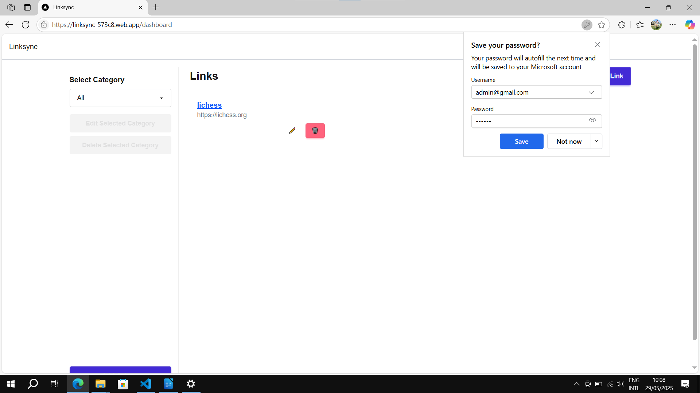

# Projeto: Aplicação Web com Persistência de Dados do Lado do Servidor

Acesso: [https://linksync-573c8.web.app/](https://linksync-573c8.web.app/)

## Desenvolvedores

* **Lorenzo Facco Comunello** - [Sistemas de informação, UFSM](https://www.ufsm.br/cursos/graduacao/santa-maria/sistemas-de-informacao).

## Produto

O LinkSync é uma aplicação web desenvolvida para armazenar e sincronizar links entre dispositivos, permitindo que os usuários organizem suas URLs de forma eficiente e intuitiva. A solução prioriza a facilidade de uso, e permite que links sejam adicionados, organizados em categorias, e removidos de forma rápida.

A aplicação tem como tema principal o **compartilhamento de informações**, sendo uma plataforma útil para organizar links de interesse de forma colaborativa.

## Desenvolvimento

A aplicação foi construída utilizando Next.js com Firebase para persistência de dados. O Next.js foi escolhido para garantir o uso das melhores práticas em desenvolvimento de aplicações web, como renderização do lado do servidor (SSR), gerenciamento de rotas e integração com API.

### Tecnologias

* **Next.js**: Framework React para construção de aplicações web com SSR (Server-Side Rendering) e funcionalidades PWA.
* **Firebase**: Usado para persistência de dados no Firestore, autenticação com Firebase Auth e hospedagem.
* **Tailwind CSS e daisyUI**: Utilizados para a estilização da aplicação de forma ágil e responsiva.
* **React**: Biblioteca principal para construção de interfaces de usuário.

### Ambiente de desenvolvimento

* **VS Code**: Editor de código.
* **Firebase Emulator Suite**: Para testar autenticação e Firestore localmente.

### Referências e créditos

* [Next.js Documentation](https://nextjs.org/docs)
* [Firebase Documentation](https://firebase.google.com/docs)
* [Tailwind CSS Documentation](https://tailwindcss.com/docs).

#### Uso de IA

Durante o desenvolvimento do projeto, foram utilizadas ferramentas de inteligência artificial, como ChatGPT e GitHub Copilot durante diversas etapas, principalmente:

* Definição da pilha de tecnologias.
* Desenvolvimento frontend.
* Geração de código boilerplate para as funcionalidades do sistema.
* Auxílio para compreensão de código e arquitetura do projeto.
* Auxílio na detecção de problemas.

---

Projeto entregue para a disciplina de [Desenvolvimento de Software para a Web](http://github.com/andreainfufsm/elc1090-2025a) em 2025a.
